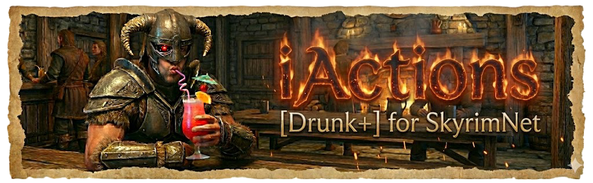

# iActions [Drunk+] for SkyrimNet - Quick Start

## 👉 [**Latest Release v0.5.7 here!!!**](https://github.com/Gerkinfeltser/iActions/releases/tag/0.5.7)

> ## ⚠️ **Warning: Experimental**
> Test on separate/non-precious saves first if you're risk-averse!  
> 🚨 **Upgrading from less than v0.5.1 requires clean migration:** [See upgrade notes below](#quick-installation)  
> (For overly-detailed documentation on all the things, see the [iActions Wiki](https://github.com/Gerkinfeltser/iActions/wiki).)

## TL;DR
### **What it does**: NPCs drink, get drunk & sober over time (plus a few extras) via SkyrimNet actions
- **NEW v0.5.7**: Sleep Sobering — Drunk NPCs gradually sober up while you sleep (configurable PointsPerSleepHour, default: 4)
- **v0.5.5**: NPCs can sit & drink at the same time... generally, prompt updated & ready for SkyrimNet Beta14
- **v0.5.1.x**: NPCs can now request to trade items with you
- **v0.5.0**: 5-tier drunk system (Buzzed→Blackout), major performance optimizations, new MCM settings, rebranded to clarify non-official status
- **Install**: Mod manager → Load after OAR drunk animations → Configure in MCM
- **Requirements**: Skyrim SE/AE + SkyrimNet + OAR + JContainers + PO3_SKSEFunctions + [drunk animations](https://www.nexusmods.com/skyrimspecialedition/mods/62191) (optional)

## Quick Installation
1. Install requirements (SkyrimNet, OAR, JContainers, PO3_SKSEFunctions)
2. Install iActions with mod manager
3. Load AFTER OAR drunk animations mod
4. Configure in MCM menu

**⚠️ Upgrading from 0.5.0? Clean install required**
- PlayerInventoryAlias (introduced in v0.5.1) needs fresh install to function on existing saves

**Universal upgrade steps (v0.4.0+):**
1. MCM "Prepare for Uninstall" → Save → Quit → Disable mod → Load save → Save
2. Install new version → Enable → Load save
3. Use `setstage SKI_ConfigManagerInstance 1` if MCM doesn't appear

**Upgrading from v0.3.0?** (No MCM uninstall)
1. Use SkyrimNet WebUI: Run `WebUI_PrepareForUninstall()` on `iActions_MCM` script
2. Save → Quit → Disable mod → Load save → Save
3. Install new version → Enable → Load save

## What It Does
- **Drunk System**: NPCs drink alcohol → get drunk → sober up automatically (5 levels: Buzzed, Tipsy, Drunk, Plastered, Blackout)
- **Sleep Sobering**: NPCs lose drunk points while you sleep (configurable rate, default 4 points/hour)
- **Actions**: Drink alcohol, request alcohol, sober up, extract arrows, stumble
- **Player Features**: Force push, optional in-game debug notifications
- **Performance**: Optimized inventory detection, cached alcohol lookups, reduced script lag

## Key MCM Settings
- Alcohol required by default (can be disabled completely or only in inns/taverns)
- 20-second cooldowns to prevent drink/stumble spam
- Auto-incremental sobering every 5 minutes (configurable)
- **v0.5.7**: Sleep Sobering — PointsPerSleepHour (0-100, default: 4). Points drunk NPCs lose per hour of sleep. Set to 0 to disable. Example: 8 hours sleep × 4 points = 32 points lost (~4 drunk tiers)
- **v0.5.1**: Exchange Items (max types tracked: default 20, tested up to 50; more items = longer processing)
- **v0.5.0**: Max simultaneous drunk NPCs (8-128, default 32)
- **v0.5.0**: Toggle drink animations (user preference for animation timing)
- **v0.5.0**: Performance logging for optimization monitoring
- Key-bindable shove (middle-mouse button works well, unbound by default)
- All(/most) settings in MCM menu

---

For full details, see the [iActions Wiki](https://github.com/Gerkinfeltser/iActions/wiki).